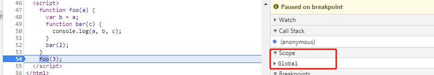
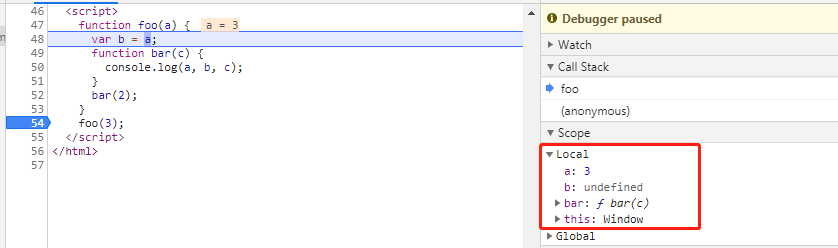
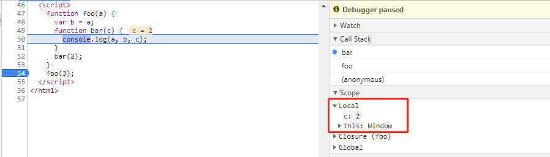

---
title: 作用域是什么？
date: 2020-11-01
tags:
  - JS
---# 作用域是什么？

对于作用域是什么的问题，我一直以来都不知道如何去解释，直到我看了《你不知道的 Javascript（上卷）》，从编译原理开始去理解作用域，会更加清晰。

### 从编译开始

在传统编译语言，程序中的一段源码在执行之前会经历三个步骤，统称为“编译”。

- 分词/词法分析

代码其实就是字符串，词法分析过程就是将字符串分解成有意义的代码块，这些代码块被称作词法单元。比如，“var a = 2”，会被分解成：var，a，=，2。

- 解析/语法解析

这个过程就是将词法单元流（数组）转换成一个由元素逐级嵌套所组成的代表了程序语法结构的树，即抽象语法树（AST）。

比如`var a = 6`，解析成的 AST 是这样的：

```json
{
  "type": "Program",
  "body": [
    {
      "type": "VariableDeclaration",
      "declarations": [
        {
          "type": "VariableDeclarator",
          "id": {
            "type": "Identifier",
            "name": "a",
            "range": [36, 37],
            "loc": {
              "start": {
                "line": 2,
                "column": 4
              },
              "end": {
                "line": 2,
                "column": 5
              }
            }
          },
          "init": {
            "type": "Literal",
            "value": 6,
            "raw": "6",
            "range": [38, 39],
            "loc": {
              "start": {
                "line": 2,
                "column": 6
              },
              "end": {
                "line": 2,
                "column": 7
              }
            }
          },
          "range": [36, 39],
          "loc": {
            "start": {
              "line": 2,
              "column": 4
            },
            "end": {
              "line": 2,
              "column": 7
            }
          }
        }
      ],
      "kind": "var",
      "range": [32, 39],
      "loc": {
        "start": {
          "line": 2,
          "column": 0
        },
        "end": {
          "line": 2,
          "column": 7
        }
      },
      "leadingComments": [
        {
          "type": "Line",
          "value": " Life, Universe, and Everythi",
          "range": [0, 31],
          "loc": {
            "start": {
              "line": 1,
              "column": 0
            },
            "end": {
              "line": 1,
              "column": 31
            }
          }
        }
      ]
    }
  ],
  "sourceType": "script",
  "range": [32, 39],
  "loc": {
    "start": {
      "line": 2,
      "column": 0
    },
    "end": {
      "line": 2,
      "column": 7
    }
  }
}
```

- 代码生成

将 AST 转换为可执行代码，这个过程和语言，目标平台有关，简单地说就是转换成一组机器指令并执行。

JavaScript 任何代码片段在执行之前都要进行编译。

### 什么是作用域

为了更好地理解 JavaScript 的工作原理，我们需要知道引擎，编译器和作用域分别做了什么。

- 引擎

负责 JavaScript 程序的编译和执行

- 编译器

就是以上说的词法分析，语法分析，代码生成这些工作

- 作用域

负责收集和维护所有声明的标识符（可以说是变量）组成的一系列查询，并制定一套非常严格的规则，以确定当前执行的代码对这些标识符的访问权限。

这里提到了作用域，可以将其定义为一套规则，这套规则用来管理在当前作用域以及嵌套的子作用域中根据标识符进行变量的查找。

### 词法作用域模型

作用域主要有两种模型：一种是词法作用域，这是大多数编程语言采用的模型，JavaScript 采用的也是这种工作模型；另一种是动态作用域。

简单地说，词法作用域就是定义在词法阶段的作用域。也就是说，**词法作用域由你在写代码时将变量和块作用域写在哪里决定，并且在词法分析阶段保持不变**。

一般来讲，函数或者是块可以创建新的作用域。当一个块或者函数在另一个块或者函数中时，就发生了作用域的嵌套。

我们来看以下代码：

```js
function foo(a) {
  var b = a;
  function bar(c) {
    console.log(a, b, c);
  }
  bar(2);
}
foo(3);
```

这里可以看到有三层作用域：

1. 首先是全局作用域，其中有一个标识符 foo；
2. 函数 foo 会创建自己的作用域，其中包含 3 个标识符：a,b,bar;
3. 函数 bar 也会创建自己的作用域，其中包含一个标识符：c。

> 注意，函数传参的过程其实是声明并赋值的过程，比如在 foo 函数中，当我们给函数传参数 3 时，其实会执行“var a = 3”.

这里就发生了作用域的嵌套。**在嵌套作用域中，如果在当前作用域中无法找到某个变量时，引擎就会在外层嵌套的作用域中继续查找，直到找到该变量或者抵达最外层的作用域，也即是全局作用域。**

更直观的，当我们对上述代码进行 debugger 时：

1. 全局作用域，展开`Global`可以看到 foo，因为包含太多，这里就不展开了



2. 单步调试到下一步，进入 foo 函数，其函数作用域内包含 a，b，bar



3. 下一步，进入 bar 函数，其函数作用域包含 c



### 函数作用域

之前我们讲到函数或者块可以创建作用域。函数作用域的含义就是，属于这个函数的变量可以在整个函数范围内使用。

函数作用域在实际的项目开发中有很大作用，尤其是多人协同开发的项目中。

- 隐藏内部实现

有时候，也许我们的某个函数或者某个变量，只在特定的情况下使用，如果放在全局作用域下，如果被误用，造成一些副作用，这是我们不愿意看到的。有了函数作用域，就可以把这个函数或者变量放在函数作用域内，这样外部作用域就不能访问，也就避免了误用。

比如：

```js
function doSomething() {
  function doSomethingElse() {
    //...
  }
  doSomethingElse();
}

doSomething();
```

这里就相当于把函数`doSomethingElse`私有化保护起来，避免外部误用。

- 规避冲突

在多人协同开发时，命名冲突是很容易发生的事情。如果将所有变量都放置在全局作用域下，很容易出现名字重复的事情。这时候，将自己用的变量包裹到函数中，因为函数作用域的存在，就可以使得相同的命名也不受影响。

```js
function foo() {
  var a = 1;
  console.log(a);
}
function bar() {
  var a = 2;
  console.log(a);
}
var a = 3;
console.log(a);
```

虽然有 3 个标识符为 a 的变量，但是相互不受影响。

### 块作用域

块作用域在很多编程语言中普遍使用，但在 JavaScript 中用的不多。

```js
for (var i = 0; i < 3; i++) {
  console.log(i);
}
console.log(i);
```

在 for 循环头部定义的变量 i，会被绑定到外部作用域，这里就是全局作用域，这点在开发中经常被忽略。

幸而，在 ES6 中，引入了 let 声明，let 关键字可以将变量绑定到所在的任意作用域，通常是`{...}`内部。

```js
for (let i = 0; i < 3; i++) {
  console.log(i);
}
console.log(i); //会报错，不能访问到i
```

同理，ES6 中 const 也可以创建块作用域，不同的是其值是常量。
