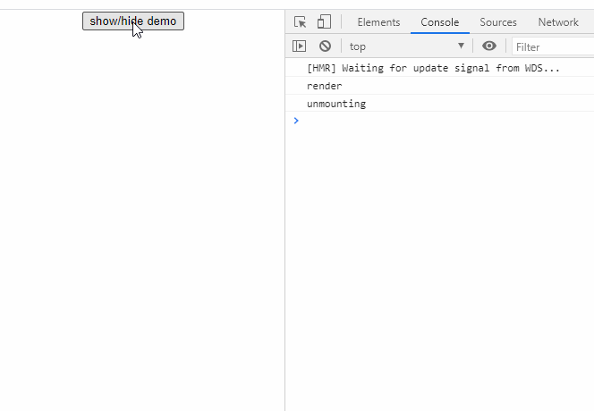
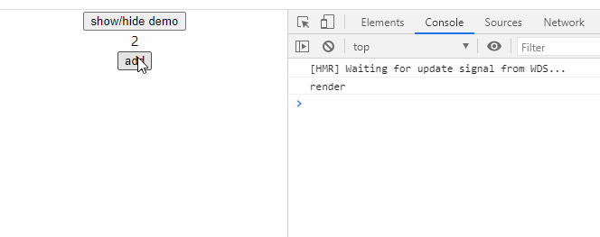
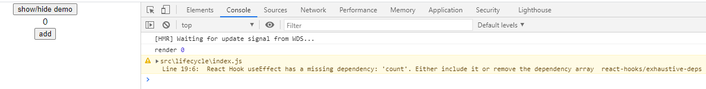

# useEffect Hook 是怎么工作的

useEffect Hook 在 react 项目开发时使用场景非常多，比如在组件挂载完成时请求数据，又比如在状态更新时执行额外的操作。如果我们理解了 useEffect 的工作原理，就能很好地使用它来完成这些功能。本文试图从实际例子中来体会 useEffect 的工作原理

## useEffect 和生命周期

如果你熟悉 react 中类组件，自然会对生命周期比较了解。虽然函数组件没有生命周期这一说法，但是 useEffect 让我们能让代码在合适的时候执行，来模拟生命周期函数。

首先，让我们用例子来展示如何让一段代码在组件挂载时(componentDidMount)，组件更新时(componentDidUpdate)，以及组件卸载之前(componentWillMount)执行。

```js
// lifecycle/index.js
import { useEffect, useState } from 'react';

const LifeCycle = () => {
  const [count, setCount] = useState(0);

  useEffect(() => {
    console.log('render');
    return () => {
      console.log('unmounting');
    };
  });

  return (
    <div>
      <div>{count}</div>
      <button
        onClick={() => {
          setCount(count + 1);
        }}
      >
        add
      </button>
    </div>
  );
};

export default LifeCycle;
```

```js
import { useState } from 'react';

import LifeCycle from './lifecycle';

function App() {
  const [isHidden, setIsHidden] = useState(false);
  return (
    <div className="App">
      <button onClick={() => setIsHidden(!isHidden)}>show/hide demo</button>
      {!isHidden && <LifeCycle></LifeCycle>}
    </div>
  );
}

export default App;
```

当我们点击显示隐藏切换按钮时，看到控制台会在组件消失前输出'unmounting'，在组件出现时输出'render'。当我们点击 add 按钮时，控制台每次都会同时输出'unmounting'和'render'。



为什么每次更新状态时都会输出'unmounting'，难道每次都要卸载组件吗？

其实，useEffect 中返回的函数，不仅仅在组件卸载前调用，它在当前副作用执行前都会调用，以清除上一个副作用。这其实比 componentWillUnmount 更有用，因为你可以在渲染前后都执行副作用代码（如果你有需要这么做）。

以上例子可以看出，useEffect 默认在每次渲染时都会执行，但有时我们并不希望这么频繁地执行副作用，比如我们只需要在组件挂载完成时请求数据，而不需要每次状态改变时都去请求数据，毕竟每次请求数据都一样，浪费了资源。这里就要提到 useEffect 的第二个参数，也就是副作用的依赖项。所谓依赖，也就是说只有依赖项的值改变时，useEffect 才执行。如果我们要 useEffect 只执行一次，那就依赖项为空数组（**是空数组，不是不传**）

```js
useEffect(() => {
  console.log('render');
  return () => {
    console.log('unmounting');
  };
}, []);
```

这样，只有在组件挂载时会执行一次，在点击 add 按钮更新状态时并不会执行。



如果副作用依赖于 count，则在依赖数组中添加 count

```js
useEffect(() => {
  console.log('render');
  return () => {
    console.log('unmounting');
  };
}, [count]);
```

这样，只有 count 发生变化时，副作用才会执行。

## useEffect 何时执行

**默认情况下，useEffect 会在组件渲染完成后执行**。

现在，有 3 个层层嵌套的组件，分别有自己的副作用：

```js
function Top() {
  const [count, setCount] = useState(0);

  useEffect(() => {
    console.log('Top rendered');
  });

  return (
    <div>
      <div onClick={() => setCount(count + 1)}>Top Level {count}</div>
      <Middle />
    </div>
  );
}

function Middle() {
  const [count, setCount] = useState(0);

  useEffect(() => {
    console.log('Middle rendered');
  });

  return (
    <div>
      <div onClick={() => setCount(count + 1)}>Middle Level {count}</div>
      <Bottom />
    </div>
  );
}

function Bottom() {
  const [count, setCount] = useState(0);

  useEffect(() => {
    console.log('Bottom rendered');
  });

  return <div onClick={() => setCount(count + 1)}>Bottom Level {count}</div>;
}
```

控制台输出依次是：Bottom rendered，Middle rendered，Top rendered

很好理解，任何子组件没有渲染完成，这个组件就不算渲染完成。

当我们点击组件中的元素，可以看到其副作用的执行也是从最里层的组件开始。

## 不要忽视警告

很多开发者在使用 useEffect 时会烦犯的一个错误是尽管副作用真的依赖于某些变量，却仍然将依赖项传空（即空数组[]）。如果你使用`create-react-app`脚手架创建的项目，ESLint 通常会给警告。比如，当我们把组件稍作修改：

```js
useEffect(() => {
  // 这里其实是依赖于变量count
  console.log('render', count);
  return () => {
    console.log('unmounting');
  };
}, []);
```

控制台得到警告



**当你向 useEffect 中传递了一个函数，该函数会创建一个闭包，该闭包在创建函数时“锁定”到它所引用的任何变量的值**。而依赖项为空数组的意思是，永远不要重新创建闭包，因为不依赖任何会变的变量。显然，count 是会变的，在依赖项中添加 count，意在高数 react 在 count 变化时，重新创建闭包，这样就能以最新的值创建闭包。

## 在 useEffect 中请求数据

请求数据并渲染是一个非常常见的应用场景。在类组件中，一般把请求数据并更新的逻辑放在 componentDidMount 中，在函数组件中，我们用 useEffect 来做。

```js
import { useEffect, useState } from 'react';

const Students = () => {
  const [list, setList] = useState([]);

  useEffect(() => {
    fetch('http://localhost:8080/mock/students')
      .then((res) => res.json())
      .then((res) => setList(res.data));
  }); //这里没有传依赖项，会发生什么？

  return (
    <div>
      {list.map((item) => (
        <li key={item.guid}>{item.name}</li>
      ))}
    </div>
  );
};

export default Students;
```

我们知道，useEffect 发生在每次渲染之后。在例子中，当组件渲染完，执行 useEffect，即请求数据，并更新状态，从而又触发一次渲染，然后又执行 useEffect，循环往复，这显然不是我们所期望的。

如果要阻止这种情况，我们需要为 useEffect 指定依赖，可以是 setList，当然也可以是空（空数组意味着只执行一次 useEffect）。

```js
useEffect(() => {
  fetch('http://localhost:8080/mock/students')
    .then((res) => res.json())
    .then((res) => setList(res.data));
}, [setList]);
```

> 为什么可以是 setList？其实，当我们执行 useState 时，返回的更新函数只会创建一次，不论组件渲染多少次，更新函数始终是一样的。

但有时候，我们又需要在合适的时候重新请求数据，比如，当班级 ID 切换时，更新学生数据

```js
import { useEffect, useState } from 'react';

const Students = ({ classId }) => {
  const [list, setList] = useState([]);

  useEffect(() => {
    fetch(`http://localhost:8080/mock/students?classId=${classId}`)
      .then((res) => res.json())
      .then((res) => setList(res.data));
  }, [classId]);

  return (
    <div>
      {list.map((item) => (
        <li key={item.guid}>{item.name}</li>
      ))}
    </div>
  );
};

export default Students;
```

```js
import { useState } from 'react';

import Students from './students';

function App() {
  const [classId, setClassId] = useState(1);
  return (
    <div className="App">
      <button onClick={() => setClassId(classId + 1)}>change class</button>
      <Students classId={classId}></Students>
    </div>
  );
}

export default App;
```

我们将 classId 作为 useEffect 的依赖，当 classId 变化时，就会重新请求数据。

就写这么多了，更多文章，参见 github:[唐凯强/front-end-interview](https://github.com/唐凯强/front-end-interview)
