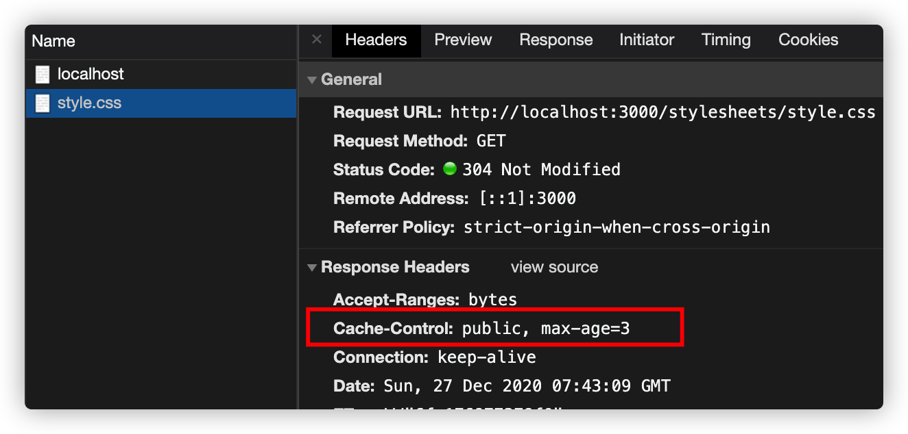
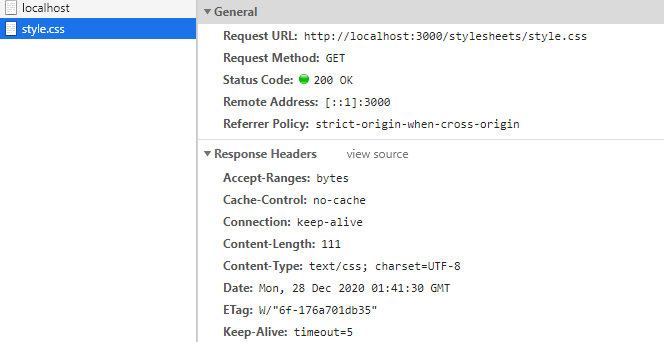
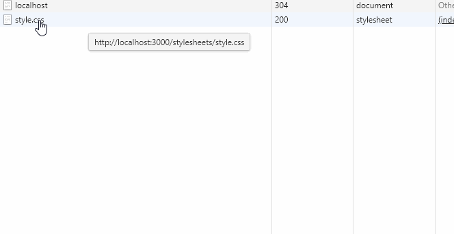
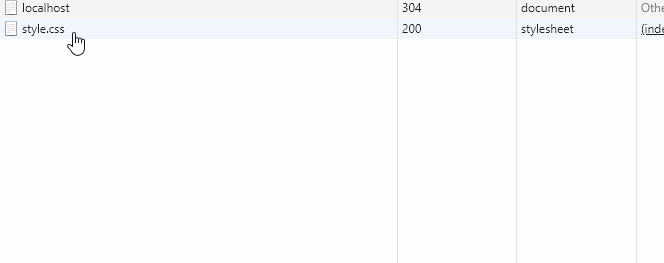
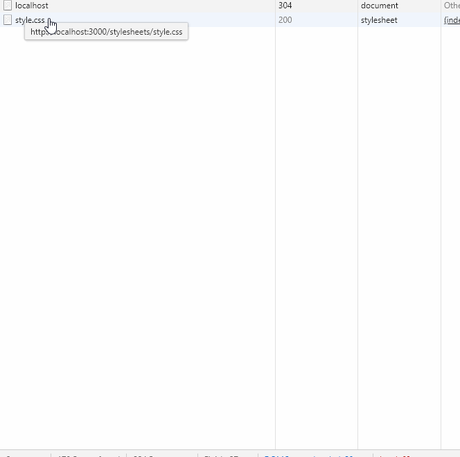
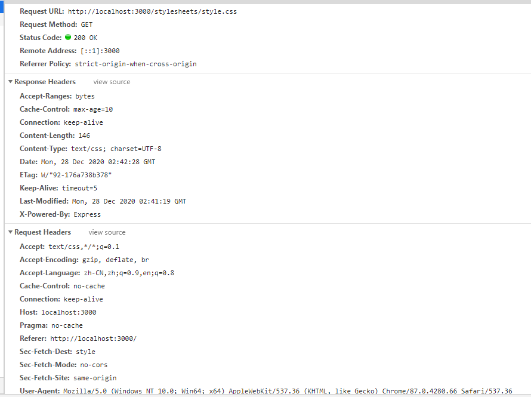

# web 缓存之 HTTP Cache Headers

在 web 应用中，一般针对静态资源如 css，js，图片文件等使用缓存。使用缓存的好处有：

1. 请求更快：通过将资源存储在本地浏览器或者最近的缓存服务器（如 CDN），可以大大地提高请求响应速度。

2. 节省带宽：对于已缓存的资源，可以减少请求带宽甚至不需要网络请求。

3. 降低服务器压力：将静态资源放置在不同的网络节点，可以起到负载均衡的作用，降低了单个服务器的压力。

缓存分为服务端缓存（比如 Nginx）和客户端缓存（比如浏览器）。

关于客户端缓存，主要是通过配置 HTTP Cache Headers 来实现。恰巧看到一篇博文详细讲解了 HTTP Cache Headers，就翻译出来分享一下。

源文章：[HTTP Cache Headers - A Complete Guide](https://www.keycdn.com/blog/http-cache-headers)

## HTTP cache headers 说明

缓存主要通过**新鲜度（freshness）**和**验证（validation）**来处理内容。如果经过验证，资源内容并没有更改，则可以直接从缓存中获取资源，而不必再次请求资源。如果没有验证标志（比如 ETag 或者 Last-Modified 头），并且缺少明确的新鲜度信息，通常被认为是不能缓存的。我们将重点转移到你应该关注的标头信息（headers）上来。

#### 1. **Cache-Control**

任何资源都可以使用`Cache-Control`HTTP 标头来定义自己的缓存策略。`Cache-Control`指令控制谁来缓存响应资源，以及在什么情况下缓存和维持多久。



不需要通过服务器的请求被视为最好的请求：响应资源的本地副本可以消除网络延迟以及数据传输产生的数据费用。HTTP 规范使服务器能够发送几个不同的 `Cache-Control`指令，这些指令控制浏览器在其他中间缓存（例如 CDN）中缓存各个响应的方式和时间。

```
Cache-Control: private, max-age=0, no-cache
```

这些就是响应指令，接下来一一讲解：

**`public` vs `private`**

被标记为`public`的响应资源会在任何情况下缓存，即使是需要 HTTP 认证的资源。在大多数情况下，标记为 `public` 的响应不是必需的，因为显式的缓存信息（例如 `max-age`）表明响应无论如何都是可缓存的。

相反，标记了`private`的响应资源通常是针对单个用户的，因此它们不能被中间缓存所缓存（例如，带有私人用户信息的 HTML 页面可以由用户的浏览器缓存，而不能由 CDN 缓存）。

**`no-cache` and `no-store`**

`no-cache`表明，在检查服务器响应是否已更改之前，返回的响应不能用于对同一 URL 的后续请求。如果存在合适的 Etag（验证令牌），`no-cache`会发送请求来验证缓存中的资源。如果资源没有改变，则会取消下载资源。换句话说，浏览器会缓存资源，但是在每次请求时都必须验证资源是否改变（如果没有改变，则为 304 响应）



可以看到，在 Etag 有效的情况下，`no-cache`会先验证资源是否已改变，不变则使用缓存中的资源，即 304

相反，`no-store`更简单。它不允许浏览器缓存任何响应资源，每次用户请求资源时，请求都会发送到服务器，资源重新下载。



可以看到，尽管有 Etag 验证令牌存在，仍然每次都重新请求资源

**`max-age`**

`max-age`指令指定了资源可以被再次利用的最大时限，以秒为单位。举例来说，`max-age=30`表明存储在浏览器缓存中的资源能在 30 秒内被再次利用，超过 30 秒则需要再次请求。



注意看 `Status Code` 的变化，在 30 秒内，无论多少次刷新，资源都是直接读取缓存中的（`Status Code: 200 OK (from memory cache)`），而超过 30 秒后，再次请求资源（`Status Code: 200 OK`）

**`s-maxage`**

“ s-”代表共享，就像在共享缓存中一样。该指令明确用于其他中间缓存中的 CDN。此伪指令将覆盖 max-age 伪指令，并在出现时使标头字段过期。

**`must-revalidate`**

`must-revalidate`指令用于告诉缓存，它必须在过时后首先重新验证具有来源的资源。未经端到端重新验证，不得将资源交付给客户。简而言之，必须首先验证陈旧的资源，并且不应使用过期的资源。

**`proxy-revalidate`**

`proxy-revalidate`指令与`must-revalidate`指令相同，但是，它仅适用于共享高速缓存（例如代理）

**`no-transform`**

`no-transform`指令告诉任何中介（例如代理服务器或缓存服务器）不要对原始资源进行任何修改。`Content-Encoding`，`Content-Range`和`Content-Type`标头必须保持不变。

#### 2. **Pragma**

旧的 Pragma 标头可完成许多功能，其中大多数功能都采用较新的实现。但是，我们最关心的是 Pragma：no-cache 指令，该指令在较新的实现中被解释为 Cache-Control：no-cache。

#### 3. **Expires**

`Expires`标头指定的是资源过期的时间，是一个基本的日期时间戳，即在改时间之前可以使用缓存，在这之后就要再次请求资源。但是，重要的是要注意，在大多数现代系统中，Cache-Control 标头，max-age 和 s-maxage 仍然优先。但是，出于兼容性考虑，在此处设置匹配值是一种很好的做法。确保正确设置日期格式或将其视为已过期也很重要。

#### 4. **验证器**

**`ETag`**

根据 HTTP/1.1 标准，这种验证令牌：

- 通过 ETag HTTP 标头（由服务器）进行通信。

- 启用有效的资源更新，如果资源不变，则不传输任何数据。

接下来用例子来说明。现在有一个设置了 10 秒过期的资源，在 10 秒后再次请求时，浏览器会先找到本地缓存，发现缓存不可用（因为资源过期了），然后就会重新下载完整资源。但问题是，这个资源可能并没有改变，所以没有任何理由再重新下载资源。

验证令牌就是用来解决这个问题的。令牌由服务器创建，并存储再 ETag 头字段中返回，这些令牌通常是文件内容的哈希值。客户端不需要知道令牌是如何生成的，只需要在后续的请求中将其发送到服务器。服务器比较前后两次令牌，如果相同，则资源没有改变，可以跳过下载。

Web 浏览器在`If-None-Match` HTTP 请求标头中自动提供 ETag 令牌。然后，服务器对照缓存中的当前资产检查令牌。 `304 Not Modified` 响应将告知浏览器缓存中的资产是否尚未更改，因此允许续签 10 秒钟。重要的是要注意，无需再次下载这些资产，从而节省了带宽和时间。



注意看`Status Code`的变化，第一次请求是`200 OK`，在 10 秒内刷新请求，是`200 OK (from memory cache)`，即读取的缓存资源，10 秒后刷新请求，是`304 Not Modified`，即验证令牌没变表示资源没有改变，还是使用的缓存资源，此时请求会携带`If-None-Match`请求头。

浏览器为 Web 开发人员完成了大部分工作（如果不是）。例如，它们自动检测先前是否已指定验证令牌，并将其附加到传出请求中，并根据服务器的响应根据需要更新缓存时间戳。因此，Web 开发人员只剩下一项工作，即确保服务器提供所需的 ETag 令牌。

**`Last-Modified`**

`Last-Modified`标头指示文档上次更改的时间，这是最常见的验证器。从 HTTP / 1.0 时代起，它就可以视为旧式验证器。当缓存存储包含 `Last-Modified` 标头的资源时，它可以利用它查询服务器该表示是否随时间改变（因为它是最后一次见到）。可以使用 `If-Modified-Since` 请求标头字段来完成。

HTTP / 1.1 源服务器应同时发送 ETag 和 Last-Modified 值。



## 小结

`Cache-Control`以及 `ETag` 标头字段是控制资产新鲜度和有效性的现代机制。其他值仅用于向后兼容
