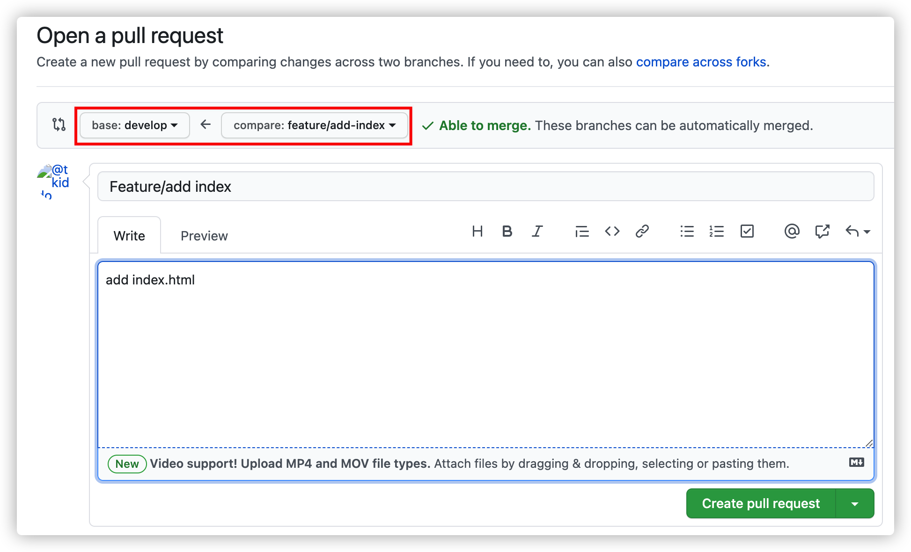
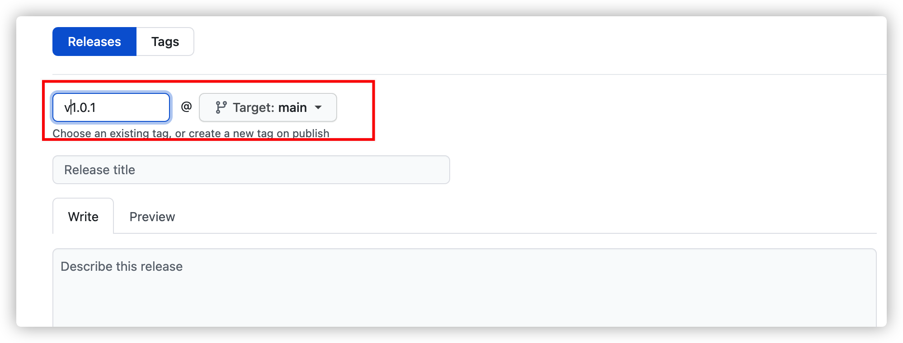

# Git FLow 实践

首先，上一张 Git Flow 开发模式的整体流程图：


简短地描述整个流程：

1. 从开发版的分支（develop）创建工作分支（feature branches），进行功能的实现或修正

2. 工作分支（feature branches）的修改结束后，与开发版的分支（develop）合并

3. 重复 1 和 2，不断实现功能直至可以发布

4. 创建用于发布的分支（release branches），处理发布的各项工作

5. 发布工作完成后与 main 分支合并，打上版本标签（Tag）进行发布

6. 如果发布的软件出现 BUG，以打了标签的版本为基础进行修正（hotfix）

这样描述可能还是没什么印象，现在我们来实践以下这套流程。

## 开始一个项目

我在 github 上新建了一个项目(https://github.com/tkiddo/git-flow-action)，以此作为案例。

首先，克隆项目远程仓库到本地。

```shell
git clone https://github.com/tkiddo/git-flow-action
```

## 安装 git-flow

有了项目，我们现在要安装 git-flow，各位请根据自己当前的环境进行安装。

以已经安装了 HomeBrew 的 Mac 为例：

```shell
brew install git-flow
```

安装完成后运行 git flow 以确认：

```shell
git flow

usage: git flow <subcommand>

Available subcommands are:
   init      Initialize a new git repo with support for the branching model.
   feature   Manage your feature branches.
   release   Manage your release branches.
   hotfix    Manage your hotfix branches.
   support   Manage your support branches.
   version   Shows version information.

Try 'git flow <subcommand> help' for details.
```

## 初始化 git-flow

初始化 git flow 使用 init 命令，如果不打算改变默认值，则可以附上-d 参数。

```shell
git flow init -d

Using default branch names.

Which branch should be used for bringing forth production releases?
   - main
Branch name for production releases: [main]
Branch name for "next release" development: [develop]

How to name your supporting branch prefixes?
Feature branches? [feature/]
Release branches? [release/]
Hotfix branches? [hotfix/]
Support branches? [support/]
Version tag prefix? []
```

这里确定了不同类型分支的命名方法，也就是添加不同的前缀。

这时查看分支：

```shell
git branch -a
* develop
  main
  remotes/origin/HEAD -> origin/main
  remotes/origin/main
```

可以看到添加了开发版分支（develop），这是接下来开发的起点。因为其他同事开发其他功能也是以 develop 分支为起点的，所以需要将本地 develop 分支推送到远程以便同事拉取。

```shell
git push origin develop
```

## 第一个功能

现在，我们要开发第一个功能，添加一个文件`index.html`，功能命名为`add-index`。

```shell
git flow feature start add-index

Switched to a new branch 'feature/add-index'

Summary of actions:
- A new branch 'feature/add-index' was created, based on 'develop'
- You are now on branch 'feature/add-index'

Now, start committing on your feature. When done, use:

     git flow feature finish add-index
```

根据执行说明，基于开发版分支(develop)创建功能分支`feature/add-index`，当功能分支开发完毕后，执行`git flow feature finish add-index`

查看分支

```shell
git branch
  develop
* feature/add-index
  main
```

可以看到，当前工作分支就是新创建的功能分支`feature/add-index`。

在当前分支上开发新功能，添加了 index.html.

```html
<!DOCTYPE html>
<html lang="en">
  <head>
    <meta charset="UTF-8" />
    <meta name="viewport" content="width=device-width, initial-scale=1.0" />
    <title>Document</title>
  </head>
  <body>
    <h1>Hello,World !</h1>
  </body>
</html>
```

然后提交作业：

```shell
git add index.html

git commit -m 'add index.html'
```

功能开发期间，你可能希望同事能看到自己写的代码，并加以指点，这时候就需要将本地仓库推送到远程。

```shell
git flow feature publish add-index

Enumerating objects: 4, done.
Counting objects: 100% (4/4), done.
Delta compression using up to 8 threads
Compressing objects: 100% (3/3), done.
Writing objects: 100% (3/3), 443 bytes | 443.00 KiB/s, done.
Total 3 (delta 0), reused 0 (delta 0), pack-reused 0
remote:
remote: Create a pull request for 'feature/add-index' on GitHub by visiting:
remote:      https://github.com/tkiddo/git-flow-action/pull/new/feature/add-index
remote:
To https://github.com/tkiddo/git-flow-action
 * [new branch]      feature/add-index -> feature/add-index
Already on 'feature/add-index'
Your branch is up to date with 'origin/feature/add-index'.

Summary of actions:
- A new remote branch 'feature/add-index' was created
- The local branch 'feature/add-index' was configured to track the remote branch
- You are now on branch 'feature/add-index'
```

从执行说明看到，创建了远程分支`feature/add-index`,本地分支`feature/add-index`跟踪这个远程分支。

查看分支信息

```shell
git branch -a

  develop
* feature/add-index
  main
  remotes/origin/HEAD -> origin/main
  remotes/origin/develop
  remotes/origin/feature/add-index
  remotes/origin/main
```

可以看到远程功能分支已经创建了。

## 第一个功能开发完毕

经过多次提交代码之后，第一个功能总算开发完毕了。这时候需要通过 GitHub 发送 Pull Request，请求 develop 分支合并 feature/add-index 分支的内容。



> 注意 base 是 develop 分支，而不是 main 分支

经过其他开发者审查代码，并修改之后，确认 Pull Request 没有问题，则可以合并到 develop 分支。

然后功能分支就开发完毕了，你可以删除该分支,也可以删除远程分支。

```shell
git branch -d feature/add-index

git push origin --delete feature/add-index
```

当我们开发更多功能时，也是新建分支，在分支上作业，完成开发后提交 Pull Request，确认后合并到 develop 分支

## 可以发布了

当功能开发进行到差不多完善的时候，就可以发布版本了。首先，我们要拉取最新的 develop 分支代码

```shell
git checkout develop

git pull
```

然后，创建 release 分支

```shell
git flow release start v1.0.0

Switched to a new branch 'release/v1.0.0'

Summary of actions:
- A new branch 'release/v1.0.0' was created, based on 'develop'
- You are now on branch 'release/v1.0.0'

Follow-up actions:
- Bump the version number now!
- Start committing last-minute fixes in preparing your release
- When done, run:

     git flow release finish 'v1.0.0'
```

执行后，基于 develop 分支，新的发布分支 release/v1.0.0 创建，在该分支上，我们只处理与发布相关的提交。这里以变更版本号为例：

```markdown
// README.md

# git-flow-action

git flow 实践

version:v1.0.0
```

然后，提交修改

```shell
git add README.md

git commit -m 'release v1.0.0'
```

当与发布相关的提交处理完毕后，我们需要结束这一分支

```shell
git flow release finish v1.0.0
```

然后，release 分支会合并到 main 分支，在这之前会需要你填提交信息

```
Merge branch 'release/v1.0.0' into main
# Please enter a commit message to explain why this merge is necessary,
# especially if it merges an updated upstream into a topic branch.
#
# Lines starting with '#' will be ignored, and an empty message aborts
# the commit.
```

填写提交信息后保存退出，之后会询问版本号信息

```
#
# Write a message for tag:
#   v1.0.0
# Lines starting with '#' will be ignored.
```

一般情况下，把版本号前的`#`去掉即可

再后来，release 分支会合并到 develop 分支，在这之前也会询问提交信息

```
Merge branch 'release/v1.0.0' into develop
# Please enter a commit message to explain why this merge is necessary,
# especially if it merges an updated upstream into a topic branch.
#
# Lines starting with '#' will be ignored, and an empty message aborts
# the commit.
```

填写完提交信息后保存退出，可以看到执行信息

```
Switched to branch 'main'
Your branch is up to date with 'origin/main'.
Merge made by the 'recursive' strategy.
 README.md  |  5 ++++-
 index.html | 13 +++++++++++++
 2 files changed, 17 insertions(+), 1 deletion(-)
 create mode 100644 index.html
Switched to branch 'develop'
Your branch is up to date with 'origin/develop'.
Merge made by the 'recursive' strategy.
 README.md | 5 ++++-
 1 file changed, 4 insertions(+), 1 deletion(-)
Deleted branch release/v1.0.0 (was 1f2e386).

Summary of actions:
- Latest objects have been fetched from 'origin'
- Release branch has been merged into 'main'
- The release was tagged 'v1.0.0'
- Release branch has been back-merged into 'develop'
- Release branch 'release/v1.0.0' has been deleted
```

总结一下，就是

- release 分支合并到了 main 分支，
- 创建了与版本号相同的 Git 标签，
- release 分支合并到 develop 分支
- release 分支被删除

到现在为止，main 和 develop 分支都发生了改变，所以都需要提交

```shell
git checkout develop

git push origin develop
```

然后，是 main 分支

```shell
git checkout main

git push origin main
```

最后，提交标签信息

```
git push --tags
```

至此，v1.0.0 版本已经发布成功了

## BUG 出现了

最新的 v1.0.0 版本出现 bug 了，需要紧急修复。

以 main 分支（也就是 v1.0.0 版本）为起点，创建 v1.0.1 的 hotfix 分支

```shell
git flow hotfix start v1.0.1

Switched to a new branch 'hotfix/v1.0.1'

Summary of actions:
- A new branch 'hotfix/v1.0.1' was created, based on 'main'
- You are now on branch 'hotfix/v1.0.1'

Follow-up actions:
- Bump the version number now!
- Start committing your hot fixes
- When done, run:

     git flow hotfix finish 'v1.0.1'
```

这条命令创建了 hotfix/v1.0.1 分支，在这个分支中提交修复，并推送到远程仓库，并向 main 分支发送 Pull Request。

其他开发者查看 Pull Request，确认并同意合并到 main 分支。

然后，就是创建新的标签 v1.0.1

点击 Github 仓库的 release 菜单，然后点击 Draft a new release 按钮。



然后，publish release 即可，这样，我们就多了一个标签 v1.0.1

最后，就是将 hotfix 分支合并到 develop 分支即可。

## 小结

这么一套下来，对 Git Flow 就有一定的理解了。
