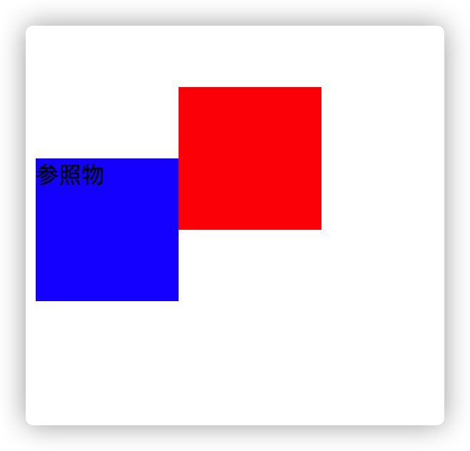
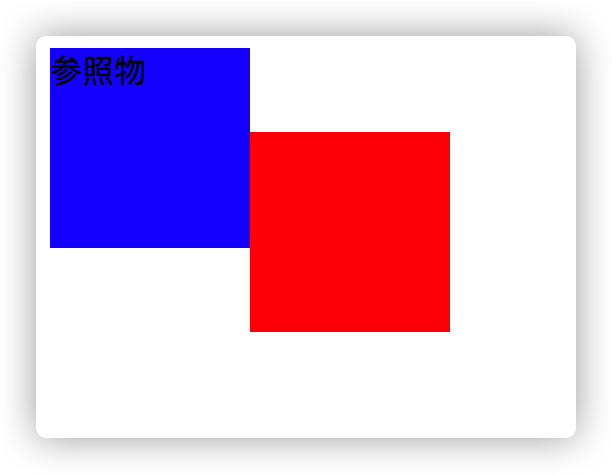
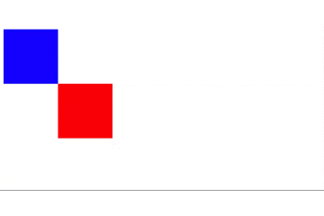

# CSS Position

Css `position`属性用于指定一个元素在文档中的定位方式。

`position`取值有五种：

- `static`

该关键字指定元素使用正常的布局行为，即元素在文档常规流中的布局位置。此时`top`，`right`,`bottom`,`left`和`z-index`无效。

- `relative`

元素相对于自身在未设置定位时的位置调整位置，但不会改变页面原先的布局（也就是说会在元素原来的位置留下空白）。

```html
<!DOCTYPE html>
<html lang="en">
  <head>
    <title>Document</title>
    <style>
      .box {
        width: 100px;
        height: 100px;
        background-color: blue;
      }

      .relative-box {
        position: relative;
        top: 50px;
        background-color: red;
        margin-left: 100px;
      }
    </style>
  </head>
  <body>
    <div class="container">
      <div class="box relative-box"></div>
      <div class="box">参照物</div>
    </div>
  </body>
</html>
```

效果是这样的



按照块元素各占一行的原则，两个元素不应该有高度重叠的部分，但是由于红的方块使用了`relative`定位，不影响其他元素布局，所以即使自身调整了位置，其他元素还在原位不动。

- `absolute`

使用`absolute`定位的元素会被移出正常的文档流，并且不会为元素留出空间。通过指定元素相对于最近的非 static 定位祖先元素的偏移，来确定元素位置。

```html
<!DOCTYPE html>
<html lang="en">
  <head>
    <title>Document</title>
    <style>
      .box {
        width: 100px;
        height: 100px;
        background-color: blue;
      }

      .absoulte-box {
        position: absolute;
        top: 50px;
        background-color: red;
        margin-left: 100px;
      }
    </style>
  </head>
  <body>
    <div class="container">
      <div class="box absoulte-box"></div>
      <div class="box">参照物</div>
    </div>
  </body>
</html>
```



可以看到，红方块被移出文档流后，不占用空间。

- `fixed`

和`absolute`相同，元素会被移出正常文档流，并不为元素预留空间，不同的是通过指定元素相对于屏幕视口（viewport）的位置来指定元素位置。

- `sticky`

粘性定位可以被认为是`relative`定位和`fixed`定位的混合。元素在跨越特定阈值前为`relative`定位，之后为`fixed`定位。

```html
<!DOCTYPE html>
<html lang="en">
  <head>
    <title>Document</title>
    <style>
      .box {
        width: 100px;
        height: 100px;
        background-color: blue;
      }

      .sticky-box {
        position: sticky;
        top: 50px;
        background-color: red;
        margin-left: 100px;
      }

      .scroll-content {
        height: 4000px;
      }
    </style>
  </head>
  <body>
    <div class="container">
      <div class="box"></div>
      <div class="box sticky-box"></div>
      <div class="scroll-content"></div>
    </div>
  </body>
</html>
```

使用`sticky`定位的元素，在 viewport 视口滚动到元素 top 小于 50px 之前，元素是相对定位，之后，元素将固定在与顶部 50px 的位置，直到 viewport 视口滚动到阈值以下。



# 利用定位填充空间

被绝对定位的元素可以通过指定`top`和`bottom`，保留`height`未指定，来填充可用的垂直空间。同样，也可以通过指定`left`和`right`并将`width`指定未 auto 链填充水平空间。

比如，如果要元素占满空间：

```css
.fill {
  position: absoulte;
  top: 0;
  left: 0;
  bottom: 0;
  right: 0;
}
```

更多文章，参见 github：[tkiddo/front-end-interview](https://github.com/tkiddo/front-end-interview)
