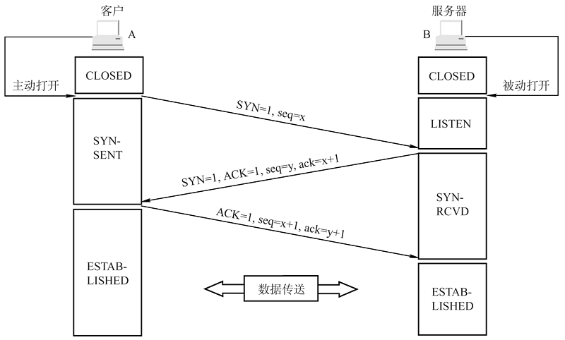
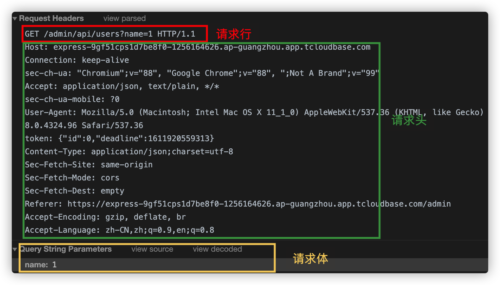
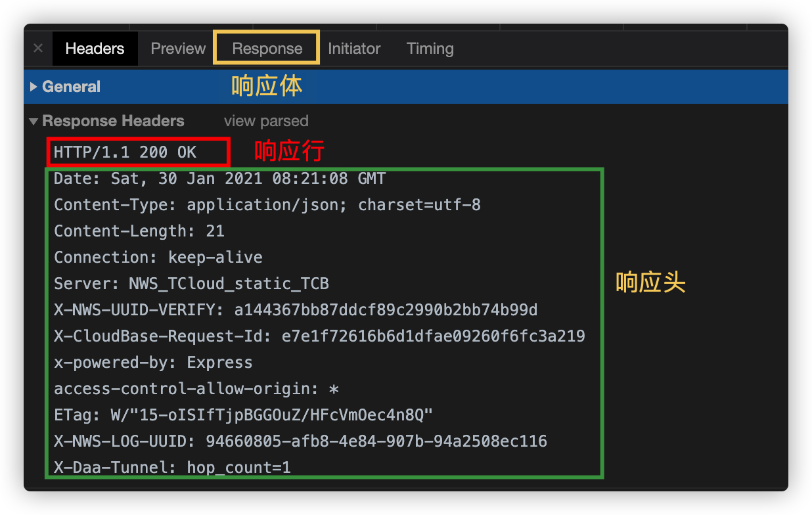
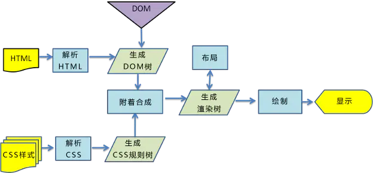
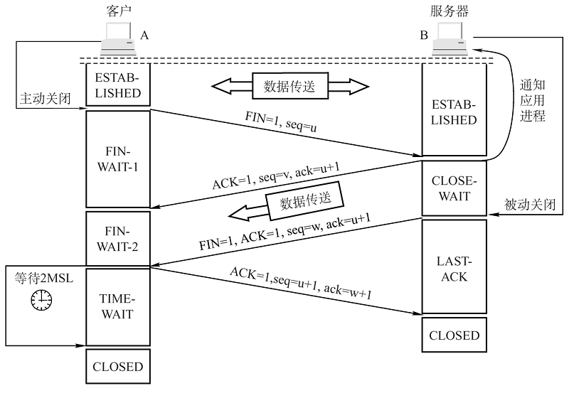

# 从输入 URL 到网页展示，之间发生了什么？

从输入 URL 到浏览器渲染页面，主要经历以下几个过程(不考虑缓存)：

1. 输入 URL

2. DNS 解析：将域名解析为 IP 地址

3. 浏览器与服务器建立 TCP 连接：三次握手

4. 浏览器向服务器发送 http 请求

5. 服务器处理请求，并返回 HTTP 报文

6. 浏览器解析并渲染页面

7. 断开连接：四次挥手

接下来，我们来一一讲解这几个过程

## URL

**URL 代表着是统一资源定位符（Uniform Resource Locator）。**理论上说，每个有效的 URL 都指向一个唯一的资源。这个资源可以是一个 HTML 页面，一个 CSS 文档，一幅图像，等等。

一个 URL 由不同的部分组成，其中一些是必须的，而另一些是可选的。让我们以下面这个 URL 为例看看其中最重要的部分：

```
http://www.example.com:80/path/to/myfile.html?key1=value1&key2=value2#SomewhereInTheDocument
```

- 协议： `http`是协议，它表明浏览器使用何种协议，通常是`http`或者更安全的`https`

- 域名: `www.example.com`是域名，它表明正在请求哪个 web 服务器。

- 端口: `:80`代表端口， 它表示用于访问 Web 服务器上的资源的技术“门”。如果 Web 服务器使用 HTTP 协议的标准端口（HTTP 为 80，HTTPS 为 443）来授予其资源的访问权限，则通常会被忽略。

- 路径： `path/to/myfile.html`是服务器上资源的路径，表示资源存放的位置。

- 参数： `?key1=value1&key2=value2`是提供给网络服务器的额外参数，使用`&`分隔

- 锚点: `#SomewhereInTheDocument`是资源本身的另一部分的锚点，浏览器可以定位到指定锚点。

## DNS 解析

URL 中的域名代表我们需要请求的 web 服务器，然而浏览器并不能通过域名找到对应的服务器，而是要通过 IP 地址。从域名得到 IP 地址的过程就是 DNS 解析。这部分不是本文的主要内容，就不赘述了。

## TCP 连接：三次握手

TCP 建立连接的过程如下图所示



1. 客户端发送报文，其中标志位 SYN 置为 1，初始序号 seq=x（随机生成）。随后客户端进入 SYN_SENT 状态，等待服务器确认。

2. 服务器收到数据包后，根据 SYN 为 1 知道客户端想要建立连接。服务器将 SYN 和 ACK 都置为 1，ack 为 x+1，随机生成一个初始序号 seq=y，并将数据包发送给客户端以确认连接请求，此时服务器进入 SYN_RCVD 状态。

3. 客户端收到确认后，检查 ACK 是否为 1，ack 是否为 x+1，如果正确，则将 ACK 置为 1，ack 置为 y+1，并将数据包发送给服务器。

4. 服务器收到数据后，检查 ACK 是否 wei1，ack 是否为 y+1。如果正确，则建立连接成功，客户端和服务器都进入 ESTABLISH 状态

完成三次握手后，客户端和服务器之间就可以传输数据了。

## 发送 http 请求

http 请求报文包括三部分，分别是请求行，请求头，请求体



- **请求行**

包含请求方法（一般会用到 GET，POST，PUT，DELETE 等），请求对应的 URL 地址（和请求头的 Host 属性一起组成完整的 URL）以及协议名称及版本号

- **请求头**

包含若干属性，以‘属性名：属性值’的形式传递，服务端据此获得客户端的信息

- **请求体**

包含需要传递给后端的参数信息

## 服务器处理请求并返回响应

http 响应报文包括三部分，分别是响应行，响应头，响应体



- **响应行**

包含报文协议及版本号，和响应状态码及描述。

http 响应状态码分为 5 段

```
1xx 消息，一般是告诉客户端，请求已经收到了，正在处理，别急...
2xx 处理成功，一般表示：请求收悉、我明白你要的、请求已受理、已经处理完成等信息.
3xx 重定向到其它地方。它让客户端再发起一个请求以完成整个处理。
4xx 处理发生错误，责任在客户端，如客户端的请求一个不存在的资源，客户端未被授权，禁止访问等。
5xx 处理发生错误，责任在服务端，如服务端抛出异常，路由出错，HTTP版本不支持等。
```

常见的状态码有：

1. 200 OK

   处理成功

2. 304 Not Modified

   表示资源没有更新，直接用缓存资源

3. 404 Not Found

   请求不存在

4. 500 服务器错误

   服务端报错

- **响应头**

也是包含很多属性

- **响应体**

即我们真正需要的东西

## 浏览器解析并渲染页面

当接收到页面资源后，浏览器就开始解析收到的信息。



解析过程可以分为以下步骤：

1. **构建 DOM 树**

第一步是处理 HTML 标记并构建 DOM 树。DOM 树描述了文档的内容。html 标签是第一个元素也是 DOM 树的根结点。

当解析器发现非阻塞资源，如一张图片时，浏览器会请求这些资源并继续解析。当遇到 CSS 资源时，解析也可以继续进行，但是当遇到 Javascript 文件时（特别是没有 async 或 defer 属性的），则会阻塞渲染并停止 HTML 解析。

2. **构建 CSSOM 树**

第二步是处理 CSS 并构建 CSSOM 树。CSSOM 和 DOM 是相似的，但是独立的数据结构。浏览器将 CSS 规则转换成可以理解和使用的样式映射。

**浏览器从适用于节点的最通用规则开始，并通过应用更具体的规则递归地优化计算的样式。换句话说，它级联属性值。**

比如现在有一个元素以及对应的 css

```html
<div class="box" style="color:red"></div>
```

```css
div {
  padding: 20px;
}

.box {
  font-size: 24px;
}
```

浏览器对于该元素的样式计算是从最通用的规则，即`div{padding:20px}`开始，逐渐应用更具体的规则，即`.box{font-size:24px}`，以及最后的行内样式`style='color:red'`,即最终该 div 的样式是三者的组合。

当解析完成之后，浏览器开始执行渲染过程。

3. **组合 Render 树**

第三步是将 DOM 和 CSSOM 组合成一个 Render 树，该树从 DOM 树的根结点开始构建，逐渐遍历每个节点。

> 注意，具有`display：none`样式的节点将不会显示，也就是不会出现在 Render 树上。

Render 树保存所有具有内容和计算样式的可见节点——将所有相关样式匹配到 DOM 树中的每个可见节点，并根据 CSS 级联确定每个节点的计算样式。

4. **布局**

第四步是在渲染树上运行布局以计算每个节点的几何体。布局是确定并呈现树中所有节点的宽度，高度和位置，以及确定页面上每个对象的大小和位置。**回流是对页面的任何部分或者整个文档的后续大小和位置的确定。**

即第一次确定节点的大小和位置称为布局。随后对节点大小和位置的重新计算称为回流。

5. **绘制**

最后是将各个节点绘制到屏幕上。在绘制阶段，浏览器将在布局阶段确定的每个节点转化为实际的像素，将元素的可视部分绘制到屏幕上，包括文本，颜色，边框等。

绘制过程可以将布局树中的元素分成很多层。**将内容提升到 GPU 层（而不是 CPU 上的主线程）可以提高绘制和重新绘制的性能。**比如动画使用`transform`比`position`更好。

### 渲染阻塞

JS 可以操作 DOM 来修改 DOM 结构，可以操作 CSSOM 来修改节点样式，这就导致了浏览器在遇`<script>`标签时，DOM 构建将暂停，直至脚本完成执行，然后继续构建 DOM。如果脚本是外部的，会等待脚本下载完毕，再继续解析文档。现在可以在 script 标签上增加属性 `defer` 或者 `async`。脚本解析会将脚本中改变 DOM 和 CSS 的地方分别解析出来，追加到 DOM 树和 CSSOM 规则树上。

由于 CSSOM 负责存储渲染信息，浏览器就必须保证在合成渲染树之前，CSSOM 是完备的，这种完备是指所有的 CSS（内联、内部和外部）都已经下载完，并解析完，只有 CSSOM 和 DOM 的解析完全结束，浏览器才会进入下一步的渲染，这就是 CSS 阻塞渲染。

CSS 阻塞渲染意味着，在 CSSOM 完备前，页面将一直处理白屏状态，这就是为什么样式放在 head 中，仅仅是为了更快的解析 CSS，保证更快的首次渲染。

## 断开连接：四次挥手

最后，就是客户端与服务器断开连接，经历四次挥手



1. 客户端发送连接释放报文段，停止发送数据，主动关闭 TCP 连接。FIN=1，seq=u

2. 服务器端回送一个确认报文段，客户到服务器这个方向的连接就释放了一一半关闭状态。ACK=1，seq=v, ack=u+1

3. 服务器端发完数据，就发出连接释放报文段，主动关闭 TCP 连接。FIN=1，ACK=1， seq=w， ack=u+1

4. 客户端回送一个确认报文段，再等到时间等待计时器设置的 2MSL (最长报文段寿命)后，连接彻底关闭。ACK=1，seq=u+1，ack=w+

## 小结

这就是从 URL 输入到页面展示整个过程所经历的事情，包含 DNS 解析，建立 TCP 连接，发送 HTTP 请求，浏览器得到 HTTP 响应，解析并渲染，最后断开连接。
