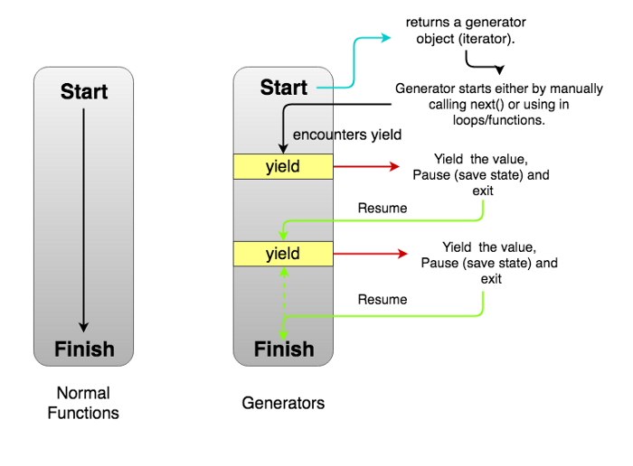

# 理解 ES6 的生成器

ES6 引入了生成器（或者说生成器函数）。生成器的功能就是可以中断函数执行，并从停止的位置继续执行。简单地说，生成器是一个函数，但是用起来像迭代器。生成器与迭代器的关系非常密切，如果你还不是很了解迭代器，那么[迭代器入门](https://github.com/唐凯强/front-end-interview/blob/main/docs/iterable.md)这篇文章可以帮你更好地理解迭代器。

## 引言

我们将从示例来理解什么是生成器以及如何使用。

## 什么是生成器

普通的函数在执行的过程中不能中断，直到执行完成。比如下面这个函数：

```js
function normalFunc() {
  console.log('I');
  console.log('cannot');
  console.log('be');
  console.log('stopped.');
}
```

退出`normalFunc`函数的方法，要么是`return`一个值，要么是`throw`一个错误。如果你重新调用这个函数，它又会从头开始执行。

相反的，**生成器函数可以中断，并且从中断处继续执行**.

通常来讲，生成器可以这么定义

- 生成器是一类特殊的函数，可以用来简化创建迭代器

- 生成器是一个可以生成一系列值的函数，而不是一个值。

在 Javascript 中，生成器函数会返回一个包含`next`方法的对象，每一次调用`next`方法，都会返回一个这样的对象：

```js
{
  value:any,
  done:true | false
}
```

其中,`value`属性包含值，`done`属性表示是否有更多的值，如果`done`变成了`true`,生成器停止执行且不会创建更多的值。

以下图示可以表示生成器的执行过程



## 创建生成器

接下来就是创建生成器

```js
function* generatorFunction() {
  // Line 1
  console.log('This will be executed first.');
  yield 'Hello, '; // Line 2
  console.log('I will be printed after the pause');
  yield 'World!';
}
const generatorObject = generatorFunction(); // Line 3
console.log(generatorObject.next().value); // Line 4
console.log(generatorObject.next().value); // Line 5
console.log(generatorObject.next().value); // Line 6
// This will be executed first.
// Hello,
// I will be printed after the pause
// World!
// undefined
```

我们使用`function*`而不是`function`来创建生成器函数。

在函数体中，没有`return`，而是使用另一个关键字`yield`。这是生成器暂停执行的操作符。当生成器执行遇到`yield`，就会暂停，并将之后的值返回出来。在例子中，就是`Hello`.

生成器也可以有返回值，但是，`return`操作会将`done`属性置为`true`，之后就不能创建更多的值了。

```js
function* generatorFunc() {
  yield 'a';
  return 'b'; // Generator ends here.
  yield 'a'; // Will never be executed.
}
```

`return`之后永远不会执行。

在第三行，我们执行了生成器函数，和普通函数不同的是，生成器函数返回一个生成器对象。**生成器对象也是迭代器，因此可以使用`for-of`循环**。第四行，我们调用了生成器对象的`next`方法，函数开始执行，直到遇到了`yield 'Hello, '`，函数会暂停执行，并返回`{value:'Hello, ',done:false}`，然后就是等待下一次调用。第五行，是第二次调用`next`方法，函数将从上一次暂停的位置继续执行，返回`{value:'World',done:false}`。记下来，再调用`next`方法，因为没有更多的值可以返回，所以返回`{value:undefined,done:true}`，这是生成器函数执行的终点。

## 生成器的用途

生成器有很多应用场景。

#### 实现迭代器

通常，我们可以通过手动创建一个包含`next`方法的可迭代对象来实现迭代器。比如这样：

```js
const iterableObj = {
  [Symbol.iterator]() {
    let step = 0;
    return {
      next() {
        step++;
        if (step === 1) {
          return { value: 'This', done: false };
        } else if (step === 2) {
          return { value: 'is', done: false };
        } else if (step === 3) {
          return { value: 'iterable.', done: false };
        }
        return { value: '', done: true };
      }
    };
  }
};
for (const val of iterableObj) {
  console.log(val);
}
// This
// is
// iterable.
```

如果使用生成器，则可以这样写

```js
function* iterableObj() {
  yield 'This';
  yield 'is';
  yield 'iterable.';
}
for (const val of iterableObj()) {
  console.log(val);
}
// This
// is
// iterable.
```

相比较而言，生成器有以下好处

- 我们不需要关心`Symbol.iterator`

- 我们不需要实现`next()`

- 我们不需要手动创建类似`{value:'this',done:false}`的返回对象

- 我们不需要保存执行状态（比如`step`）

#### 更好地异步编程

比如我们会使用`promise`或者回调函数来处理异步，就像这样

```js
function fetchJson(url) {
  return fetch(url)
    .then((request) => request.text())
    .then((text) => {
      return JSON.parse(text);
    })
    .catch((error) => {
      console.log(`ERROR: ${error.stack}`);
    });
}
```

通过使用生成器，也可以这样写（需要一些第三方库的帮助，如[co.js](https://github.com/tj/co)）

```js
const fetchJson = co.wrap(function*(url) {
  try {
    let request = yield fetch(url);
    let text = yield request.text();
    return JSON.parse(text);
  } catch (error) {
    console.log(`ERROR: ${error.stack}`);
  }
});
```

一些读者可能发现了，这和`async/await`很像，确实，`async/await`也是基于生成器实现的语法糖。

参考[co.js](https://github.com/tj/co),`async/await`可以这样实现：

```js
// 创建一个Promise模拟异步
function foo() {
  return new Promise((resolve, reject) => {
    setTimeout(() => {
      resolve(1);
    }, 1000);
  });
}

// 生成器函数
function* gen() {
  const a = yield foo();
  console.log(a);
  const b = yield foo();
  console.log(b);
}

function async(gen) {
  // 返回一个Promise
  return new Promise((resolve, reject) => {
    const g = gen();
    // 自动执行next函数
    function next(res) {
      // 如果done为true，则不再执行，返回最后的value
      if (res.done) return resolve(res.value);
      // 如果done不为true，则表示还有更多的值，继续执行
      return res.value.then((res) => {
        // 将异步结果作为参数传递给迭代器的next函数
        next(g.next(res));
      });
    }
    next(g.next());
  });
}

// 为生成器函数包裹自动执行器
async(gen);
```

#### 无限数据流

我们可以创建永远不会结束的生成器，就像这样：

```js
function* naturalNumbers() {
  let num = 1;
  while (true) {
    yield num;
    num = num + 1;
  }
}
const numbers = naturalNumbers();
console.log(numbers.next().value);
console.log(numbers.next().value);
// 1
// 2
```

在这个生成器中，有一个无限的`while`循环，也就是一直可以执行`next`方法，得到最新的`num`

## 注意事项

使用生成器需要注意两点：

1. 生成器对象的访问是一次性的。你不能遍历生成器中的值两次，如果需要再次使用，需要再创建一个生成器对象。

```js
const numbers = naturalNumbers();
console.log(...take(10, numbers)); // 1 2 3 4 5 6 7 8 9 10
console.log(...take(10, numbers)); // This will not give any data
```

2. 生成器对象中的值不能像数组一样随机访问，因为是一个一个生成的，必须按顺序访问

更多文章，参见 github:[唐凯强/front-end-interview](https://github.com/唐凯强/front-end-interview)
