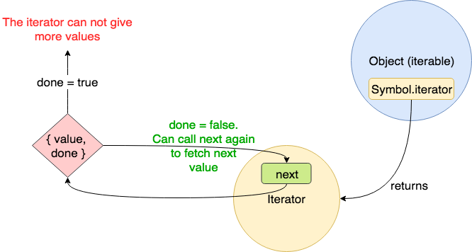

# ES6 迭代器入门

迭代器是 ES6 中新引入的用于遍历任何数据集合的方法，在多种场景中有广泛的应用。

本文将从概念上理解什么是迭代器以及用示例展示如何使用。我们还将看到其在 JavaScript 中的一些实现。

## 引言

假设你有这样一个数组：

```js
const myFavouriteAuthors = ['Neal Stephenson', 'Arthur Clarke', 'Isaac Asimov', 'Robert Heinlein'];
```

现在，你需要将其中的每一个值取出，将其打印在屏幕上，或者进行其他操作。很简单地，我们可以使用`for`,`while`,`for-of`这些循环方法对其进行循环遍历。就像这样：

```js
// for loop
for (let index = 0; index < myFavouriteAuthors.length; i++) {
  console.log(myFavouriteAuthors[index]);
}

// while loop
let index = 0;
while (index < myFavouriteAuthors.length) {
  console.log(myFavouriteAuthors[index++]);
}

// for-of loop
for (const value of myFavouriteAuthors) {
  console.log(value);
}
```

现在，假设将之前的数组改为以下结构：

```js
const myFavouriteAuthors = {
  allAuthors: {
    fiction: ['J.K.Rowling', 'Dr.Seuss'],
    scienceFiction: ['Neal Stephenson', 'Arthur Clarke'],
    fantasy: ['J.R.R.Tolkien', 'Terry Pratchett']
  }
};
```

现在，`myFavouriteAuthors`是一个包含另一个对象`allAuthors`的对象，`allAuthors`包含三个数组，`fiction`，`scienceFiction`和`fantasy`。

同样，我们用`for-of`循环遍历所有元素时，会看到

```js
for (let author of myFavouriteAuthors) {
  console.log(author);
}
// TypeError: myFavouriteAuthors is not iterable
```

错误信息告诉我们，`myFavouriteAuthors`是不可迭代的。那什么是可迭代呢？怎么让它可以迭代呢？

## 可迭代与迭代器

从以上的例子可以看出，`for-of`不能直接获得一个普通对象中的所有元素。但是可以通过循环组合的方式获得，比如，我们给`myFavouriteAuthors`对象添加`getAllAuthors`方法来获得所有元素：

```js
const myFavouriteAuthors = {
  allAuthors: {
    fiction: ['J.K.Rowling', 'Dr.Seuss'],
    scienceFiction: ['Neal Stephenson', 'Arthur Clarke'],
    fantasy: ['J.R.R.Tolkien', 'Terry Pratchett']
  },
  getAllAuthors() {
    const authors = [];
    for (const author of this.allAuthors.fiction) {
      authors.push(author);
    }
    for (const author of this.allAuthors.scienceFiction) {
      authors.push(author);
    }
    for (const author of this.allAuthors.fantasy) {
      authors.push(author);
    }
    return authors;
  }
};
```

这是一种简单的实现迭代器的方法，但是这个方法有一些缺陷：

1. `getAllAuthors`方法名是特殊的，不通用，每个人可以自己定义方法来遍历

2. 我们不一定知道获取所有元素的方法是哪个，例子中是`getAllAuthors`，但也可以是其他方法。

3. 我们需要知道所遍历的元素的类型。

ECMA 采取了类似的步骤来标准化循环遍历自定义对象的过程。但是，ECMA 使用名称`Symbol.iterator`代替了使用自定义的名称。`Symbol`提供的名称是唯一的，并且不能与其他属性名称冲突。同样，`Symbol.iterator` 将返回一个称为迭代器的对象。该迭代器将具有一个称为 `next` 的方法，该方法将返回具有`value`和`done`的对象。

其中，`value`可以是任何类型，`done`是布尔值，它表示是否有更多的值可以获取。

用下图可以表示`iterable`,`iterator`和`next`之间的关系



## 让对象可迭代

普通对象本身是不可迭代的，我们需要去实现对象的`Symbol.iterator`方法来让其变得可迭代。

一个简单的例子就是：

```js
const iterable = {
  [Symbol.iterator]() {
    let step = 0;
    const iterator = {
      next() {
        step++;
        if (step === 1) {
          return { value: 'this', done: false };
        } else if (step === 2) {
          return { value: 'is', done: false };
        } else if (step === 3) {
          return { value: 'iterable', done: false };
        }
        return { value: undefined, done: true };
      }
    };
    return iterator;
  }
};

const iterator = iterable[Symbol.iterator]();

iterator.next(); //{ value: 'this', done: false }
iterator.next(); //{ value: 'is', done: false }
iterator.next(); //{ value: 'iterable', done: false }
iterator.next(); //{ value: undefined, done: true }

for (const item of iterable) {
  console.log(item);
}
```

我们看到迭代器方法返回的是一个包含`next`方法的对象，每执行依次`next`方法，就会返回当前的值以及是否有更多值的标识`done`，直到`done`为`false`表示没有更多的值，即返回`{value: undefined, done: true}`

这其实也是`for-of`循环的内在逻辑，它一直执行`next`方法，知道`done`为`true`。

## JavaScript 中可迭代的数据结构

在 JavaScript 中有很多可迭代的数据结构：

- 数组

- 字符串

- Map

- Set

- arguments:表示函数参数的一个类数组的变量

- DOM 元素

```js
//数组: 默认迭代的是数组元素
const array = [1, 2, 3];
for (const item of array) {
  console.log(item);
}

// 字符串：默认迭代的是每一个字符
const string = 'hello';
for (const item of string) {
  console.log(item);
}

// map:默认迭代的是键值对，如["name","king"]
const map = new Map();
map.set('name', 'king');
map.set('age', 12);
for (const item of map) {
  console.log(item);
}

// set:默认迭代的是set元素
const set = new Set();
set.add('hello');
for (const item of set) {
  console.log(item);
}

// arguements:默认迭代的是函数参数值
function foo() {
  for (const arg of arguments) {
    console.log(arg);
  }
}

foo(1, 2, 3);

// DOM 元素：默认迭代的是每一个dom元素
const list = document.querySelectorAll('li');
for (const li of list) {
  console.log(li);
}
```

## 迭代器的用途

1. `for-of`循环

`for-of`循环适用于可迭代的数据，否则会报错

2. 数组的解构赋值

比如：

```js
const array = ['a', 'b', 'c', 'd', 'e'];
const [first, , third, , last] = array;
```

相当于：

```js
const array = ['a', 'b', 'c', 'd', 'e'];
const iterator = array[Symbol.iterator]();
const first = iterator.next().value;
iterator.next().value; // Since it was skipped, so it's not assigned
const third = iterator.next().value;
iterator.next().value; // Since it was skipped, so it's not assigned
const last = iterator.next().value;
```

3. 展开操作符`...`

比如：

```js
const array = ['a', 'b', 'c', 'd', 'e'];
const newArray = [1, ...array, 2, 3];
```

相当于：

```js
const array = ['a', 'b', 'c', 'd', 'e'];
const iterator = array[Symbol.iterator]();
const newArray = [1];
for (let nextValue = iterator.next(); nextValue.done !== true; nextValue = iterator.next()) {
  newArray.push(nextValue.value);
}
newArray.push(2);
newArray.push(3);
```

4. `Promise.all`和`Promise.race`接收可迭代的 Promise

5. ES6 新的可迭代的数据结构 Map 和 Set

6. 生成器（generator）与迭代器密不可分

## 为`myFavouriteAuthors`实现迭代器方法

```js
const myFavouriteAuthors = {
  allAuthors: {
    fiction: ['Agatha Christie', 'J. K. Rowling', 'Dr. Seuss'],
    scienceFiction: ['Neal Stephenson', 'Arthur Clarke', 'Isaac Asimov', 'Robert Heinlein'],
    fantasy: ['J. R. R. Tolkien', 'J. K. Rowling', 'Terry Pratchett']
  },
  [Symbol.iterator]() {
    // Get all the authors in an array
    const genres = Object.values(this.allAuthors);

    // Store the current genre and author index
    let currentAuthorIndex = 0;
    let currentGenreIndex = 0;

    return {
      // Implementation of next()
      next() {
        // authors according to current genre index
        const authors = genres[currentGenreIndex];

        // doNotHaveMoreAuthors is true when the authors array is exhausted.
        // That is, all items are consumed.
        const doNothaveMoreAuthors = !(currentAuthorIndex < authors.length);
        if (doNothaveMoreAuthors) {
          // When that happens, we move the genre index to the next genre
          currentGenreIndex++;
          // and reset the author index to 0 again to get new set of authors
          currentAuthorIndex = 0;
        }

        // if all genres are over, then we need tell the iterator that we
        // can not give more values.
        const doNotHaveMoreGenres = !(currentGenreIndex < genres.length);
        if (doNotHaveMoreGenres) {
          // Hence, we return done as true.
          return {
            value: undefined,
            done: true
          };
        }

        // if everything is correct, return the author from the
        // current genre and incerement the currentAuthorindex
        // so next time, the next author can be returned.
        return {
          value: genres[currentGenreIndex][currentAuthorIndex++],
          done: false
        };
      }
    };
  }
};

for (const author of myFavouriteAuthors) {
  console.log(author);
}

console.log(...myFavouriteAuthors);
```

原文：[https://codeburst.io/a-simple-guide-to-es6-iterators-in-javascript-with-examples-189d052c3d8e](https://codeburst.io/a-simple-guide-to-es6-iterators-in-javascript-with-examples-189d052c3d8e)


