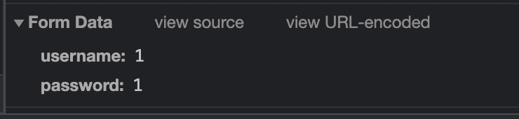
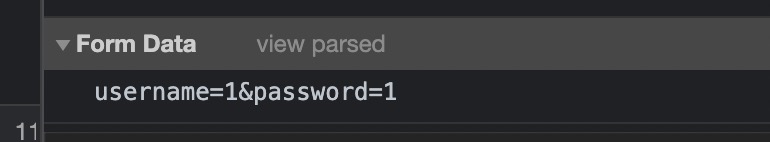
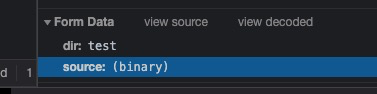
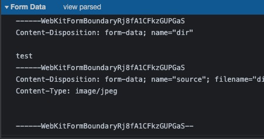

在前后端分离的开发实践中，经常会碰到前端明明传了参数，但是后端告诉你取不到参数，这时候你就需要关注一下`Content-Type`这个请求头了。

HTTP 协议是以 ASCII 码传输，建立在 TCP/IP 协议之上的应用层规范。规范把 HTTP 请求分为三个部分：状态行、请求头、消息主体。 协议规定，POST 提交的数据必须放在消息主体（entity-body）中，但协议并没有规定数据必须使用什么编码方式。服务端通常是根据请求头（headers）中的 Content-Type 字段来获知请求中的消息主体是用何种方式编码，再对主体进行解析。所以说到 POST 提交数据方案，包含了 Content-Type 和消息主体编码方式两部分 。

`Content-Type`比较常用的值有`application/x-www-form-urlencoded`，`application/json`和`multipart/form-data`。接下来，我们就来讲讲这三者的区别以及使用场景。

## `application/x-www-form-urlencoded`

这是 POST 请求最常见的编码方式，因为在浏览器的原生表单中如果不设置`enctype`属性，最终都会以`application/x-www-form-urlencode`的形式提交数据。以此种方式提交数据时，会对数据做序列化处理，以`key1=value1&key2=value2`的形式发送到服务端。

点击 view source

优点：兼容性好，所有浏览器都支持

缺点：在数据结构及其复杂时，服务端数据解析变得很难

## `application/json`

在传递较为复杂结构的数据时，`application/json`就比较适合。它告诉服务器请求的主体内容是 json 格式的字符串，服务器端会对 json 字符串进行解析，json 格式要支持比键值对复杂得多的结构化数据。这种方式的好处就是前端人员不需要关心数据结构的复杂度，只需要标准的 json 格式就能提交成功。

随着 json 规范的越来越流行，并且对浏览器支持程度原来越好，`application/json`也越来越受欢迎。

## `multipart/form-data`

除了以上两种方式，还有`multipart/form-data`，这种方式主要用于文件上传，将文件转化成二进制数据进行传输

点击 view source

## 小结

默认情况下，POST 请求以`application/x-www-form-urlencoded`编码方式传输数据，当数据结构较为复杂时，`application/json`方式更适合，而`multipart/form-data`一般适用于文件上传。

具体使用哪种编码方式，最好与后端开发沟通之后决定
