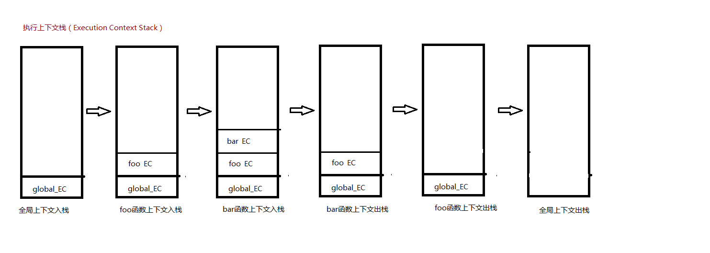

# 执行上下文（Execution Context）

执行上下文是 JavaScript 的基础概念，对于理解 JavaScript 如何执行非常有帮助。

**执行上下文可以理解为当前代码的执行环境**。JavaScript 中的执行环境主要有**全局环境**和**函数环境**。

当产生多个执行上下文时，引擎通过**执行上下文栈（Execution Context Stack）**来管理这些执行上下文。执行上下文以栈结构（一种 LIFO 的数据结构）存放起来，称为执行上下文栈。

在 JavaScript 开始执行时，首先进入全局环境，此时全局上下文被创建并压入栈，之后当调用函数时则进入对应的函数环境，也就是函数上下文被创建并压入栈，当处于栈顶的执行上下文代码执行完毕时，则将其出栈，依次执行直至全局上下文执行完毕。

举个例子：

```js
function foo(a) {
  var b = a;
  function bar(c) {
    console.log(a, b, c);
  }
  bar(2);
}
foo(3);
```

图示的方法来展示执行上下文栈的行为



在一个执行上下文中，有三个非常重要的属性：

1. Variable Object（变量对象 VO）

每一个执行环境都有一个对应的变量对象，其中存储着上下文中的**变量声明，函数声明，函数形参**

当执行上下文进入执行阶段时，变量对象就会变成**活动对象（Active Object）**，此时原先的声明就会被赋值。**变量对象和活动对象其实是一个东西，只是处于执行环境的不同极端**

2. 作用域链

作用域是根据名称查找变量的一套规则,这套规则用来管理js引擎根据标识符名称如何查找变量。而一系列的嵌套作用域就形成了作用域链。
