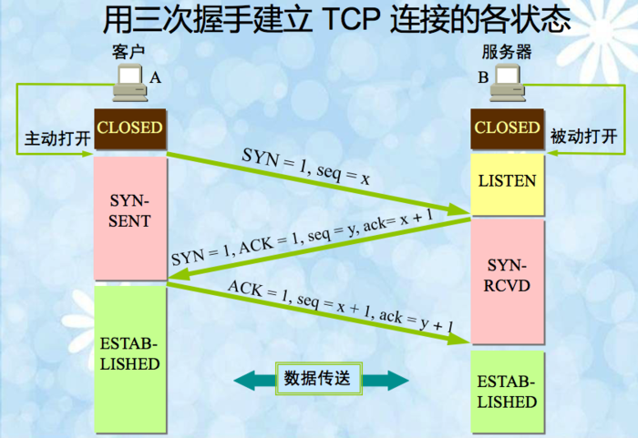

<!--
 * @Author: tkiddo
 * @Date: 2021-01-25 16:13:36
 * @LastEditors: tkiddo
 * @LastEditTime: 2021-01-26 20:50:50
 * @Description:
-->

# 从输入 URL 到网页展示，之间发生了什么？

从输入 URL 到浏览器渲染页面，主要经历以下几个过程：

1. 输入 URL

2. DNS 解析：将域名解析为 IP 地址

3. 浏览器与服务器建立 TCP 连接：三次握手

4. 浏览器向服务器发送 http 请求

5. 服务器处理请求，并返回 HTTP 报文

6. 浏览器解析并渲染页面

7. 断开连接：四次挥手

接下来，我们来一一讲解这几个过程

## URL

**URL 代表着是统一资源定位符（Uniform Resource Locator）。**理论上说，每个有效的 URL 都指向一个唯一的资源。这个资源可以是一个 HTML 页面，一个 CSS 文档，一幅图像，等等。

一个 URL 由不同的部分组成，其中一些是必须的，而另一些是可选的。让我们以下面这个 URL 为例看看其中最重要的部分：

```
http://www.example.com:80/path/to/myfile.html?key1=value1&key2=value2#SomewhereInTheDocument
```

- 协议： `http`是协议，它表明浏览器使用何种协议，通常是`http`或者更安全的`https`

- 域名: `www.example.com`是域名，它表明正在请求哪个 web 服务器。

- 端口: `:80`代表端口， 它表示用于访问 Web 服务器上的资源的技术“门”。如果 Web 服务器使用 HTTP 协议的标准端口（HTTP 为 80，HTTPS 为 443）来授予其资源的访问权限，则通常会被忽略。

- 路径： `path/to/myfile.html`是服务器上资源的路径，表示资源存放的位置。

- 参数： `?key1=value1&key2=value2`是提供给网络服务器的额外参数，使用`&`分隔

- 锚点: `#SomewhereInTheDocument`是资源本身的另一部分的锚点，浏览器可以定位到指定锚点。

## DNS 解析

URL 中的域名代表我们需要请求的 web 服务器，然而浏览器并不能通过域名找到对应的服务器，而是要通过 IP 地址。从域名得到 IP 地址的过程就是 DNS 解析。这部分不是本文的主要内容，就不赘述了。

## TCP 连接：三次握手

TCP 建立连接的过程如下图所示



1. 客户端发送报文，其中标志位 SYN 置为 1，初始序号 seq=x（随机生成）。随后客户端进入 SYN_SENT 状态，等待服务器确认。

2. 服务器收到数据包后，根据 SYN 为 1 知道客户端想要建立连接。服务器将 SYN 和 ACK 都置为 1，ack 为 x+1，随机生成一个初始序号 seq=y，并将数据包发送给客户端以确认连接请求，此时服务器进入 SYN_RCVD 状态。

3. 客户端收到确认后，检查 ACK 是否为 1，ack 是否为 x+1，如果正确，则将 ACK 置为 1，ack 置为 y+1，并将数据包发送给服务器。

4. 服务器收到数据后，检查 ACK 是否 wei1，ack 是否为 y+1。如果正确，则建立连接成功，客户端和服务器都进入 ESTABLISH 状态

完成三次握手后，客户端和服务器之间就可以传输数据了。

## 发送 http 请求

## 服务器处理请求并返回响应

## 浏览器解析并渲染页面
