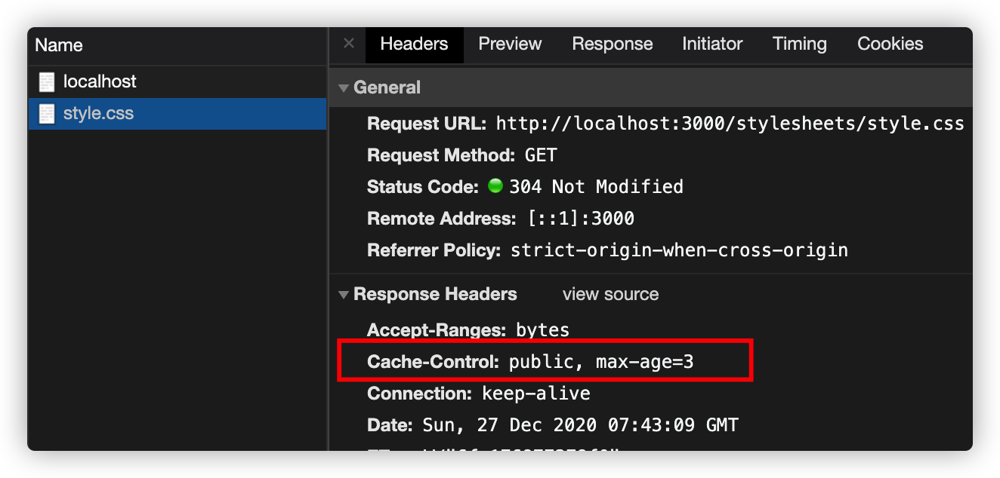

<!--
 * @Author: tkiddo
 * @Date: 2020-12-27 10:24:37
 * @LastEditors: tkiddo
 * @LastEditTime: 2020-12-27 16:31:15
 * @Description:
-->

# HTTP Cache Headers 完全指南

在 web 应用中，一般针对静态资源如 css，js，图片文件等使用缓存。使用缓存的好处有：

1. 请求更快：通过将资源存储在本地浏览器或者最近的缓存服务器（如 CDN），可以大大地提高请求响应速度。

2. 节省带宽：对于已缓存的资源，可以减少请求带宽甚至不需要网络请求。

3. 降低服务器压力：将静态资源放置在不同的网络节点，可以起到负载均衡的作用，降低了单个服务器的压力。

缓存分为服务端缓存（比如 Nginx）和客户端缓存（比如浏览器）。

关于客户端缓存，主要是通过配置 HTTP Cache Headers 来实现。恰巧看到一篇博文详细讲解了 HTTP Cache Headers，就翻译出来分享一下。

源文章：[HTTP Cache Headers - A Complete Guide](https://www.keycdn.com/blog/http-cache-headers)

## HTTP cache headers 说明

缓存主要通过**新鲜度（freshness）**和**验证（validation）**来处理内容。如果经过验证，资源内容并没有更改，则可以直接从缓存中获取资源，而不必再次请求资源。如果没有验证标志（比如 ETag 或者 Last-Modified 头），并且缺少明确的新鲜度信息，通常被认为是不能缓存的。我们将重点转移到你应该关注的标头信息（headers）上来。

1. **Cache-Control**

任何资源都可以使用`Cache-Control`HTTP 标头来定义自己的缓存策略。`Cache-Control`指令控制谁来缓存响应资源，以及在什么情况下缓存和维持多久。



不需要通过服务器的请求被视为最好的请求：响应资源的本地副本可以消除网络延迟以及数据传输产生的数据费用。HTTP 规范使服务器能够发送几个不同的 `Cache-Control`指令，这些指令控制浏览器在其他中间缓存（例如 CDN）中缓存各个响应的方式和时间。

```
Cache-Control: private, max-age=0, no-cache
```

这些就是响应指令，接下来一一讲解：

**`public` vs `private`**

被标记为`public`的响应资源会在任何情况下缓存，即使是需要 HTTP 认证的资源。在大多数情况下，标记为 `public` 的响应不是必需的，因为显式的缓存信息（例如 `max-age`）表明响应无论如何都是可缓存的。

相反，标记了`private`的响应资源通常是针对单个用户的，因此它们不能被中间缓存所缓存（例如，带有私人用户信息的 HTML 页面可以由用户的浏览器缓存，而不能由 CDN 缓存）。

**`no-cache` and `no-store`**

`no-cache`表明，在检查服务器响应是否已更改之前，返回的响应不能用于对同一 URL 的后续请求。如果存在合适的 Etag（验证令牌），`no-cache`会发送请求来验证缓存中的资源。如果资源没有改变，则会取消下载资源。换句话说，浏览器会缓存资源，但是在每次请求时都必须验证资源是否改变（如果没有改变，则为 304 响应）

相反，`no-store`更简单。它不允许浏览器缓存任何响应资源，每次用户请求资源时，请求都会发送到服务器，资源重新下载。

**`max-age`**
